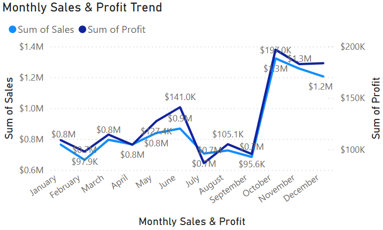
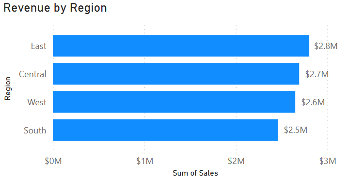
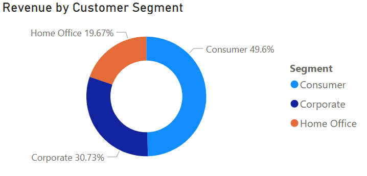
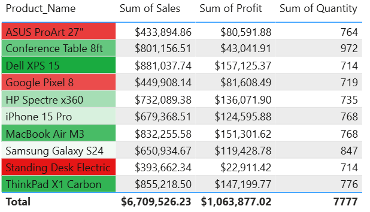

# Sales Data Dashboard

[](https://python.org)
[](https://powerbi.microsoft.com)
[](LICENSE)
[]()

> **Interactive sales analytics dashboard** analyzing 10,000 US sales transactions across 4 regions, 3 product categories, and 3 years (2023-2025). Built with Python for data processing and Power BI for visualization.

---

## Table of Contents

- [Overview](#overview)
- [Key Insights](#key-insights)
- [Dashboard Preview](#dashboard-preview)
- [Dataset](#dataset)
- [Tech Stack](#tech-stack)
- [Project Structure](#project-structure)
- [Getting Started](#getting-started)
- [Analysis Scripts](#analysis-scripts)
- [Power BI Setup](#power-bi-setup)
- [Contact](#contact)

---

## Overview

This project demonstrates end-to-end data analysis skills, covering synthetic data generation, cleaning, exploratory analysis, and interactive dashboard creation. It simulates a realistic US retail company's sales data and provides actionable business insights through visualizations.

**Business Questions Answered:**
- What are the monthly and quarterly sales trends?
- Which regions generate the most revenue and profit?
- Which product categories and sub-categories perform best?
- How do customer segments (Consumer, Corporate, Home Office) compare?
- What is the relationship between discounts and profit margins?

---

## Key Insights

| Metric | Value |
|--------|-------|
| Total Revenue | **$10.6M** |
| Total Profit | **$1.5M** |
| Profit Margin | **14.6%** |
| Total Orders | **10,000** |
| Time Period | **Jan 2023 - Dec 2025** |
| Regions | **4** (East, West, Central, South) |
| Product Categories | **3** (Technology, Furniture, Office Supplies) |

### Top Findings
- **Technology** leads in revenue but Furniture has the tightest margins
- **Q4 holiday season** consistently drives the highest sales volume
- **Consumer segment** accounts for ~50% of all orders
- Higher discounts (>20%) significantly compress profit margins

---

## Dashboard Preview

The Power BI dashboard includes:
1. **KPI Cards** - Total Revenue, Profit, Orders, and Profit Margin
2. **Sales Trend** - Monthly revenue and profit with trendlines
3. **Revenue by Region** - Bar chart comparing regional performance
4. **Category Analysis** - Product category revenue distribution
5. **Segment Breakdown** - Customer segment contribution
6. **Top Products Table** - Highest revenue products with conditional formatting

### Power BI Visualizations

| Monthly Sales & Profit Trend | Revenue by Region |
|:---:|:---:|
|  |  |

| Category Breakdown | Segment Analysis |
|:---:|:---:|
|  |  |

| Top Products |
|:---:|
|  |

---

## Dataset

The dataset contains **10,000 synthetic sales records** with 16 fields (25 after cleaning):

| Field | Type | Description |
|-------|------|-------------|
| Order_ID | String | Unique order identifier |
| Order_Date | Date | Date the order was placed |
| Ship_Date | Date | Date the order was shipped |
| Ship_Mode | String | Shipping method (Standard, Second Class, First, Same Day) |
| Customer_Name | String | Customer full name |
| Segment | String | Customer segment (Consumer, Corporate, Home Office) |
| City | String | City of the customer |
| State | String | US state |
| Region | String | US region (East, West, Central, South) |
| Category | String | Product category (Technology, Furniture, Office Supplies) |
| Sub_Category | String | Product sub-category (12 types) |
| Product_Name | String | Product name |
| Sales | Float | Revenue in USD |
| Quantity | Integer | Number of units sold |
| Discount | Float | Discount applied (0-40%) |
| Profit | Float | Profit in USD |

> See [DATA_DICTIONARY.md](DATA_DICTIONARY.md) for the full field reference including derived columns.

---

## Tech Stack

| Technology | Purpose |
|-----------|---------|
| **Python 3.10+** | Data generation, cleaning, and analysis |
| **Pandas** | Data manipulation and transformation |
| **NumPy** | Numerical operations |
| **Faker** | Synthetic data generation |
| **Matplotlib & Seaborn** | Statistical visualizations |
| **Power BI** | Interactive dashboard creation |

---

## Project Structure

```
Sales Data Dashboard/
├── README.md                    # Project overview (this file)
├── DATA_DICTIONARY.md           # Field-by-field dataset reference
├── requirements.txt             # Python dependencies
├── .gitignore                   # Git ignore rules
|
├── data/
|   ├── sales_data.csv           # Raw generated dataset (10,000 rows)
|   └── sales_data_cleaned.csv   # Cleaned dataset with derived columns
|
├── scripts/
|   ├── generate_dataset.py      # Synthetic data generator
|   ├── data_cleaning.py         # Data cleaning & transformation
|   ├── exploratory_analysis.py  # EDA with chart generation
|
└── outputs/
    ├── monthly_trend.png        # Monthly sales & profit trend
    ├── revenue_by_region.png    # Regional revenue comparison
    ├── Category_breakdown.png   # Category revenue distribution
    ├── segment_analysis.png     # Customer segment breakdown
    └── top_products.png         # Top products table
```

---

## Getting Started

### Prerequisites
- Python 3.10 or higher
- Power BI Desktop (for dashboard)

### Installation

```bash
# Clone the repository
git clone https://github.com/yourusername/sales-data-dashboard.git
cd sales-data-dashboard

# Install dependencies
pip install -r requirements.txt

# Generate the dataset
python scripts/generate_dataset.py

# Clean the data
python scripts/data_cleaning.py

# Run exploratory analysis
python scripts/exploratory_analysis.py
```

---

## Analysis Scripts

### 1. `generate_dataset.py`
Generates 10,000 realistic sales records using Faker and NumPy with:
- Seasonal patterns (Q4 holiday sales boost)
- Realistic pricing with category-specific profit margins
- Weighted customer segment distribution

### 2. `data_cleaning.py`
Transforms raw data by:
- Converting date columns to datetime
- Adding derived columns (Year, Quarter, Profit Margin, Ship Duration, etc.)
- Handling anomalies and edge cases

### 3. `exploratory_analysis.py`
Produces 6 publication-quality visualizations:
- Monthly sales & profit trends
- Revenue by region (horizontal bar)
- Category pie chart + sub-category ranking
- Top 10 products (green/red by profitability)
- Customer segment donut + margin comparison
- Quarterly revenue heatmap (Region x Quarter)

---

## Contact

**Deepak Lingala** - Data Analyst

---

*Built for data-driven insights | 2025*